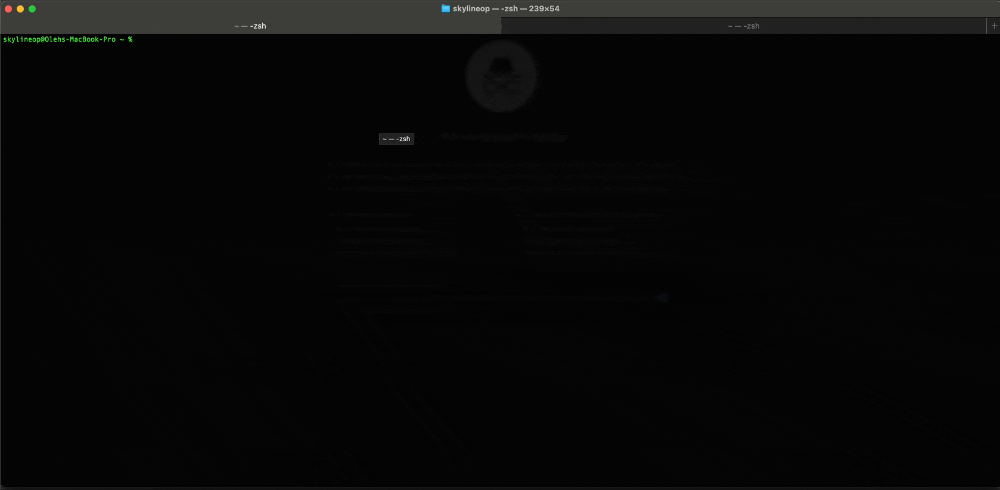

# ArgoCD access

### To get access to ArgoCD please follow next steps:

 - k3d cluster create argo-demo
 - kubectl create namespace argocd
 - kubectl apply -n argocd -f https://raw.githubusercontent.com/argoproj/argo-cd/stable/manifests/install.yaml

Inspect all resources across argocd namespace:

 - kubectl get all -n argocd

Please forward ports from external to internal

 - kubectl port-forward svc/argocd-server -n argocd 8080:443

Monitor the status of pods:

 - kubectl get po -n argocd -w

Get password for the UI interface:

 - kubectl -n argocd get secret argocd-initial-admin-secret -o jsonpath="{.data.password}" | base64 -d; echo

### UI interface can be accessed here:

https://127.0.0.1:8080/

## Here is short DEMO how to access UI interface

